# Final Project in InteProg

---

Mendoza, Joenel Christian B. \
IT2C

Short Description: This final project is a Java-based Enrollment Management System developed using OOP principles and interface-based architecture. The system allows management of students, instructors, courses, departments, sections, enrollments, and tuition calculations through a CLI application with advanced validation and exception handling.

---
#   Screenshots of code outputs:
## Main Menu:
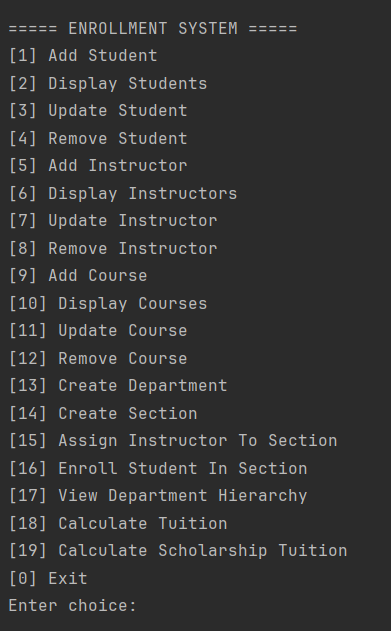

### [1] Add Student 
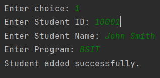

### [2] Display Students
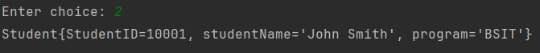

### [3] Update Student

### [4] Remove Student
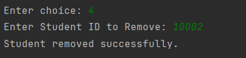

### [5] Add Instructor
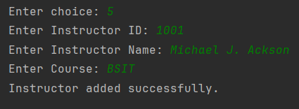

### [6] Display Instructors
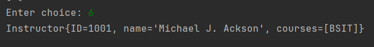

### [7] Update Instructor
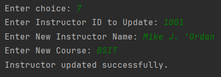

### [8] Remove Instructor
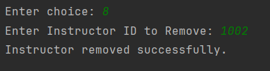

### [9] Add Course
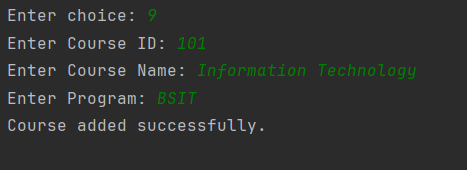

### [10] Display Courses
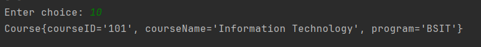

### [11] Update Course
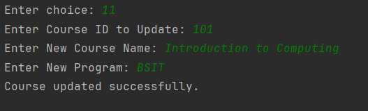

### [12] Remove Course
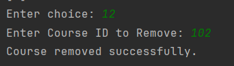

### [13] Create Department
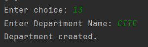

### [14] Create Section
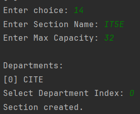

### [15] Assign Instructor To Section
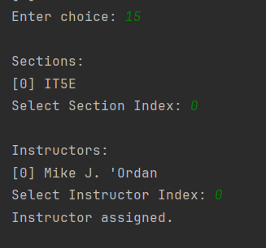

### [16] Enroll Student In Section
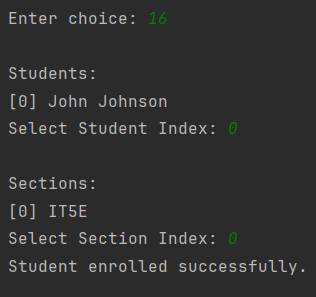

### [17] View Department Hierarchy
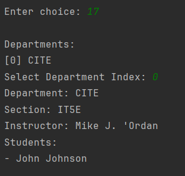

### [18] Calculate Tuition
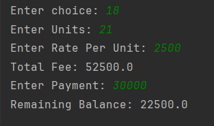

### [19] Calculate Scholarship Tuition
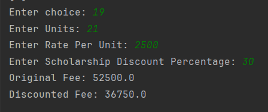